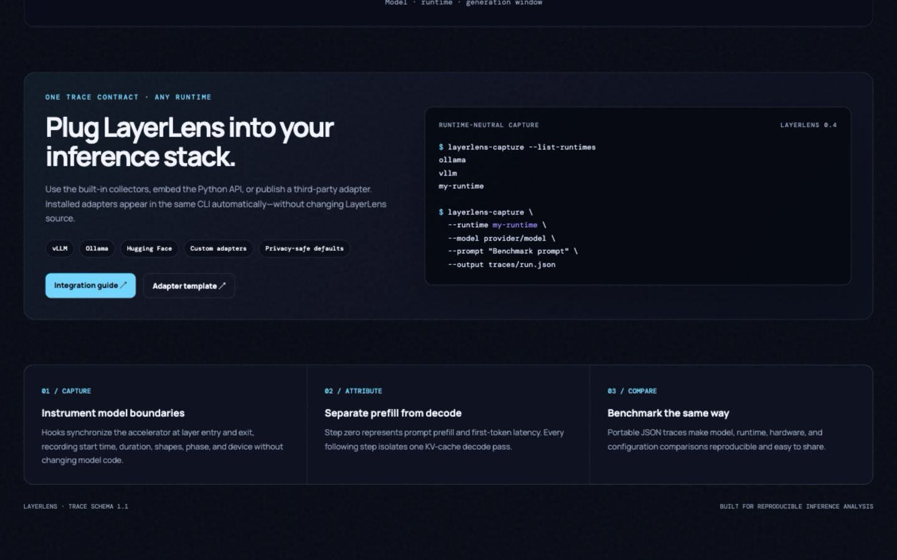
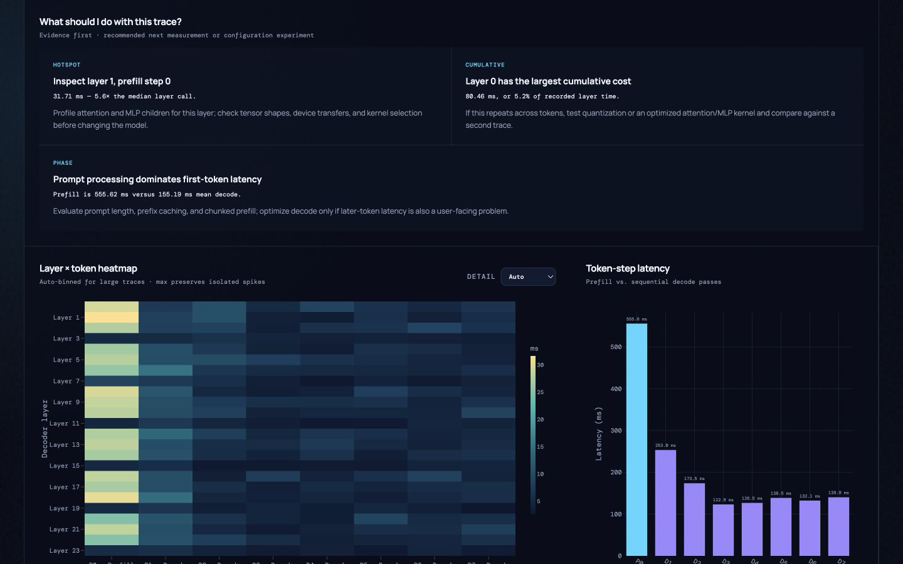
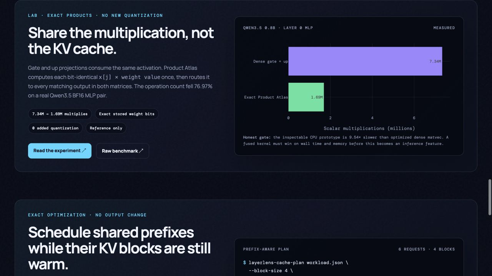
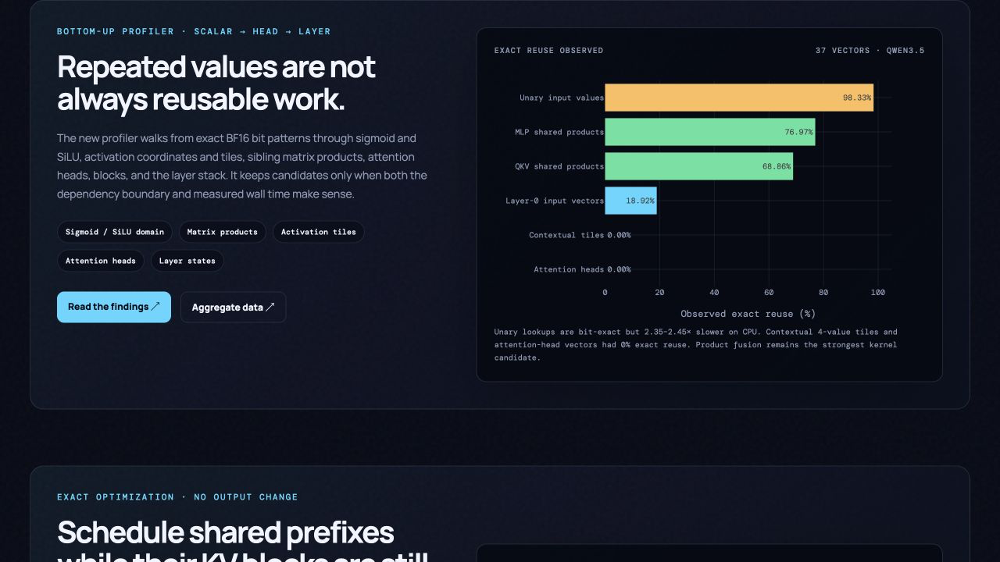
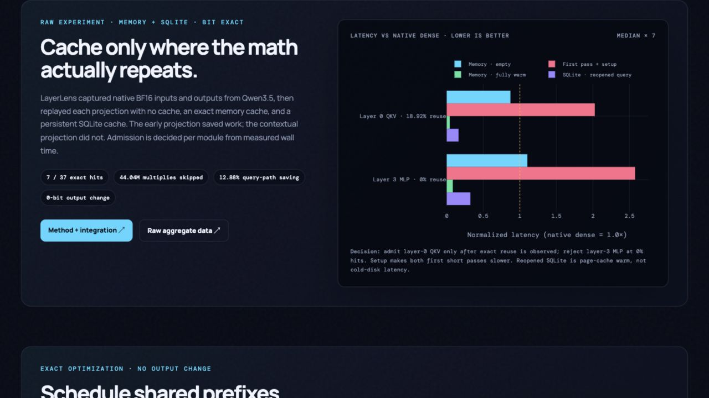
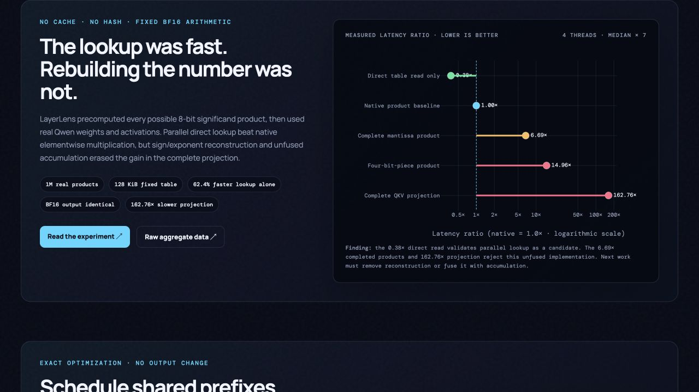

# LayerLens

**Every layer. Every token. Every millisecond.**

[](https://github.com/coconinja2/layerlens/actions/workflows/tests.yml)
[](https://coconinja2.github.io/layerlens/)
[](https://www.python.org/)

[Explore the live LayerLens benchmark →](https://coconinja2.github.io/layerlens/)


LayerLens is an offline observability tool for answering a concrete inference question:
**where does each generated token spend its time inside the model?**

## Plug it into a runtime

Use one command for built-in or externally installed adapters:

```bash
poetry install --with dashboard,dev
poetry run layerlens-capture --list-runtimes
poetry run layerlens-capture \
  --runtime ollama \
  --model gemma4:12b \
  --prompt "Benchmark prompt" \
  --output traces/run.json
```

For a standalone installation, use
`python3 -m pip install "git+https://github.com/coconinja2/layerlens.git"` and
run the same commands without the `poetry run` prefix.

LayerLens ships with `ollama` and `vllm` adapters. A third-party package can
add another runtime through the `layerlens.adapters` Python entry-point group;
the generic CLI discovers it without a LayerLens source-code change.

It also includes an exact prefix-cache planner. The planner reorders a queued
workload so requests with reusable prefixes stay close together while their KV
blocks are still resident. It never changes tokens or model output.

**[Read the complete integration guide →](INTEGRATION.md)** for vLLM,
Ollama, Python embedding, adapter packaging, supported options, privacy rules,
and a complete custom HTTP adapter template.

**[Review the cache strategy notes →](CACHE_STRATEGIES.md)** for exact prefix
reuse, modular and non-prefix KV caching, multi-tier storage, attention
compression, and layer-skipping research with explicit correctness boundaries.



It records every transformer layer during:

- the prefill pass that produces the first token;
- each subsequent KV-cache decode pass;
- in-process Hugging Face inference or an instrumented vLLM server.

For standard vLLM and Ollama endpoints, LayerLens also captures the native
engine/runtime metrics those APIs expose, without requiring model-specific
code. Exact layer timing remains opt-in because it requires execution inside
the model process.

The output is a portable JSON trace. A Streamlit dashboard turns it into a
first-token/decode scorecard, layer-by-token heatmap, sequential layer chart,
token timeline, bottleneck ranking, and raw trace explorer. Collection does
not need to run continuously or in real time.

## What the visualization shows

- **Layer × token heatmap:** which decoder layers dominate prefill and decode.
- **Actionable diagnostics:** converts isolated and cumulative hotspots into the
  next measurement or configuration experiment, with the supporting evidence.
- **Automatic level of detail:** collapses large layer/token grids into bounded
  bins while retaining count, mean, p95, maximum, and the original raw events.
- **Execution timeline:** the exact start, end, and duration of every layer call.
- **Token-step latency:** time-to-first-token separated from KV-cache decode cost.
- **vLLM engine telemetry:** KV-cache pressure, prefix-cache effectiveness,
  request concurrency, queueing, preemptions, TTFT, and prefill/decode timing.
- **Benchmark comparison:** comparable traces across models, runtimes, hardware, and generation windows.



The diagnostics deliberately recommend experiments rather than claiming a red
cell is automatically a bug: an isolated spike leads to attention/MLP and shape
inspection, repeated cumulative cost leads to kernel or quantization A/B tests,
prefill dominance leads to prompt/prefix/chunked-prefill tests, and measured
cache pressure or preemption leads to concurrency and cache-sizing experiments.


The included showcase contains two real Qwen3.5 0.8B runs captured from an
instrumented vLLM CPU server, a direct Hugging Face GPT-2 run, and a native
Ollama Gemma4 12B run. The browser dashboard is static and deploys on GitHub
Pages; the Streamlit explorer supports arbitrary local trace uploads.

## Validated model matrix

| Model | Runtime | Layer timeline | Engine/runtime metrics | Result |
|---|---|---:|---:|---:|
| Qwen3.5 0.8B | vLLM 0.27.1 | Yes, 24 layers | Yes, including KV cache | Pass |
| GPT-2 | Hugging Face Transformers | Yes, 12 layers | In-process timing | Pass |
| Gemma4 12B Q4_K_M | Ollama 0.32.14 | Not exposed by Ollama | Yes, native API | Pass |


Model selection is runtime-driven rather than hard-coded. Hugging Face layer
paths are discovered with a configurable regex, vLLM class matching is
configurable through `LLM_LAYER_CLASS_PATTERN`, and Ollama accepts any locally
installed or cloud-accessible model name.

## Experimental exact matrix-product reuse

`layerlens-product-atlas` investigates a new, non-KV reuse path. When sibling
projections consume the same activation, it finds bit-identical stored weight
values at each input coordinate, computes `activation[j] × weight_value` once,
and routes that product into every matching output. It does not quantize
weights or activations and never considers merely similar values reusable.

```bash
poetry run layerlens-product-atlas \
  --model Qwen/Qwen3.5-0.8B \
  --layer 0 \
  --benchmark-iterations 20
```

On the first BF16 Qwen3.5 0.8B MLP gate/up pair, the exact dictionary reduces
the scalar-multiplication count from 7.34M to 1.69M (76.97%). The inspectable
CPU reference is still 9.54× slower than two optimized dense matvecs because
index routing dominates. LayerLens therefore labels this a kernel research
target, not a production speedup. See [the equations, measurements, privacy
contract, and Qwen3.5 27B feasibility check](PRODUCT_ATLAS.md).



## Find repeatable calculations from scalars to heads

`layerlens-repeatability` captures aggregate bit-pattern statistics at several
levels without retaining prompts or hidden tensors:

```bash
poetry run layerlens-repeatability \
  --model Qwen/Qwen3.5-0.8B \
  --layers 0,3 \
  --max-new-tokens 24 \
  --output benchmarks/repeatability-profile.json
```

The profiler checks complete BF16 sigmoid/SiLU lookup tables, same-coordinate
values, exact activation tiles and vectors, unchanged deltas, MLP and QKV
product sharing, attention-head vectors, block boundaries, and the selected
layer stack. The first saved Qwen run found large scalar/unary repetition and
68.86–76.97% reusable scalar multiplications inside sibling projections, but
0% contextual tile, vector, and attention-head reuse. The exact unary table was
also 2.35–2.45× slower than PyTorch's native CPU operation, so it is measured
but not enabled. See [the bottom-up formulas and decisions](REPEATABILITY.md).



## Benchmark exact matrix-result caching

`layerlens-cache-benchmark` captures real inputs to selected model projections,
then times the native operation without a cache, an empty and fully warm
in-memory cache, and an SQLite cache after a close/reopen cycle:

```bash
poetry run layerlens-cache-benchmark \
  --model Qwen/Qwen3.5-0.8B \
  --max-new-tokens 24 \
  --cycles 7 \
  --disk-cache /tmp/layerlens-exact-result-cache.sqlite \
  --output benchmarks/qwen35-08b-exact-result-cache.json
```

The cache key includes the exact activation bits and a fingerprint of the exact
weight and bias bits. On the saved BF16 CPU run, an early QKV projection had
18.92% full-vector reuse, skipped 44.04M scalar multiplications, and improved
the query path by 12.88%; setup still made its first short pass slower. A layer-3
MLP projection had 0% reuse and added 10.31% overhead, so it was rejected. All
replayed and cached outputs matched the model-captured projection output bit for
bit. See [the raw methodology, results, integration API, and storage warning](CACHE_BENCHMARK.md).



## Precompute BF16 arithmetic instead of caching inputs

`layerlens-precomputed-multiply` tests fixed, direct-address arithmetic tables
on real model values. It does not hash or cache prompts, activations, or prior
results:

```bash
poetry run layerlens-precomputed-multiply \
  --model Qwen/Qwen3.5-0.8B \
  --max-pairs 1000000 \
  --output-rows 6144 \
  --iterations 7
```

The 128 KiB table reproduced one million FP32 products bit for bit. With four
threads, direct lookup alone took 0.236 ms versus 0.628 ms for native products,
but rebuilding the complete floating-point values took 4.204 ms. The full QKV
projection remained BF16-identical but was 162.76× slower than native because
lookup, reconstruction, intermediate tensors, and accumulation were not fused.
See [the raw method, measurements, and next kernel boundary](PRECOMPUTED_MULTIPLY.md).



## Reduce repeated prefill computation

`layerlens-cache-plan` simulates a bounded, full-block LRU prefix cache and
compares first-come-first-served execution with a longest-prefix-first schedule.
The input contains token IDs and trace-local request references, never prompt
text:

```bash
poetry run layerlens-cache-plan examples/cache-workload.json \
  --block-size 4 \
  --capacity-blocks 4 \
  --layers 24 \
  --hidden-size 1024 \
  --intermediate-size 3584 \
  --mlp-projections 3
```

For the included six-request workload, alternating two prefix families causes
every request to miss under the four-block budget. Cache-aware ordering groups
each family, raises the reusable-token rate from 0% to 50%, and avoids 1,152 of
2,304 layer-token evaluations. This is an exact scheduling optimization: the
serving engine must have compatible prefix caching enabled, but no approximation
or model modification is involved.

For a conventional dense decoder with those dimensions, the optional cost model
also estimates 35.03 GFLOPs of fixed attention-projection and gated-MLP matrix
multiplication avoided. It clearly excludes attention-score products,
normalization, elementwise work, MoE routing, and nonstandard attention shapes.

Use a model/revision-specific `--cache-namespace` in integrations so blocks from
different weights, adapters, or tokenizers can never match. The namespace and
token IDs are hashed internally and are not written to the report.

The public extension API consists of `CaptureRequest`, `RuntimeAdapter`,
`AdapterRegistry`, `adapter_registry`, and `capture`. Existing specialized
commands remain supported, so adoption does not require migrating working
scripts.

## Measurement model

Accelerator synchronization is enabled at layer boundaries by default. That
makes a profiled request slower, but prevents asynchronous CUDA/MPS kernel
launches from being reported as completed computation. Profiled numbers should
only be compared with other profiled numbers collected under the same settings.

Step `0` is the prompt prefill and produces generated token `0`. Steps `1..N`
are single-token decode passes. Whole-forward durations and per-layer durations
are stored independently. Parent and child module time is never silently added
together.

For direct Hugging Face profiling, step duration covers the full model forward.
For injected vLLM traces, it covers the decoder stack from the start of layer 0
through the end of the final layer; the trace records this distinction as
`step_timing_scope` metadata.

## Install with Poetry

```bash
poetry install --with dashboard,dev
```

## Profile a Hugging Face model

```bash
poetry run llm-layer-profile \
  --model Qwen/Qwen2.5-0.5B-Instruct \
  --prompt "Explain what a KV cache is." \
  --max-new-tokens 8 \
  --device cpu \
  --output traces/qwen-hf.json
```

The default selector recognizes common paths such as `model.layers.0`,
`transformer.h.0`, and `blocks.0`. Use `--module-pattern` for another model
layout. `--leaf-modules` adds attention/MLP/operator detail, with substantially
more instrumentation overhead.

## Profile a vLLM server layer by layer

vLLM's official PyTorch profiling endpoints provide rich engine and operator
traces, but HTTP clients cannot install hooks into server-side model layers.
This repository includes an opt-in `sitecustomize.py` shim for local development
servers. It patches PyTorch's module call boundary inside the container, stays
dormant unless a capture control file contains a run ID, and records only
decoder-layer calls during the requested window.

Example container launch (adjust image, cache, model, and memory flags):

```bash
mkdir -p traces/vllm_raw
docker run --name vllm-layer-profiler -p 8001:8000 --shm-size=1g \
  -e PYTHONPATH=/layer-profiler-inject \
  -e LLM_LAYER_PROFILER=1 \
  -e LLM_LAYER_PROFILE_CONTROL=/profiles/layer-profiler.control \
  -e LLM_LAYER_PROFILE_EVENTS=/profiles/vllm-layer-events.jsonl \
  -v "$PWD/vllm_inject:/layer-profiler-inject:ro" \
  -v "$PWD/traces/vllm_raw:/profiles" \
  -v "$HF_CACHE_DIR:/root/.cache/huggingface" \
  vllm-cpu:arm64 \
  --model Qwen/Qwen3.5-0.8B --enforce-eager --max-model-len 2048
```

Capture exactly one request after the server is ready:

```bash
poetry run llm-layer-profile-vllm \
  --base-url http://localhost:8001 \
  --model Qwen/Qwen3.5-0.8B \
  --prompt "Explain a KV cache in one sentence." \
  --max-tokens 8 \
  --output traces/qwen-vllm.json
```

The capture polls vLLM's Prometheus-compatible `/metrics` endpoint during the
request and records request-scoped counter deltas plus a KV-cache/concurrency
timeline. Endpoint URLs, raw Prometheus labels, prompts, generated text,
hostnames, usernames, and filesystem paths are not stored. Use
`--include-content` only when the text is intentionally safe to retain.

### Metrics-only mode: no injection required

Every standard vLLM server can produce an engine/KV trace without mounting the
optional layer hook:

```bash
poetry run layerlens-vllm \
  --base-url http://localhost:8000 \
  --model your-org/your-model \
  --prompt "Benchmark prompt" \
  --max-tokens 32 \
  --metrics-only \
  --output traces/engine-metrics.json
```

This mode works across model architectures because it consumes vLLM's public
OpenAI-compatible completion and Prometheus APIs. Add the injection shim only
when exact decoder-layer timing is required. For servers launched with API-key
authentication, set `VLLM_API_KEY`; the value is used as a bearer token for the
request and metrics endpoint and is never serialized.

### Python integration

```python
from pathlib import Path
from layer_profiler.vllm import capture_vllm

capture_vllm(
    base_url="http://localhost:8000",
    model="your-org/your-model",
    prompt="Benchmark prompt",
    max_tokens=32,
    control_path=Path("traces/layer-profiler.control"),
    events_path=Path("traces/layer-events.jsonl"),
    output_path=Path("traces/run.json"),
    layer_events=False,  # metrics-only; works on an unmodified vLLM server
)
```

## Benchmark Ollama models

Ollama exposes aggregate load, prompt-evaluation, generation, and token metrics
through its native API. LayerLens also records safe model architecture,
quantization, context capacity, and loaded processor-memory data:

```bash
poetry run layerlens-ollama \
  --model gemma4:12b \
  --prompt "Benchmark prompt" \
  --max-tokens 8 \
  --output traces/gemma4.json
```

Ollama does not currently expose actual block-level KV-cache occupancy through
its API. LayerLens therefore reports estimated context utilization separately
and never labels it as measured KV-cache usage. Cloud authentication uses
`OLLAMA_API_KEY`, which is never written to the trace.

The class matcher covers common `DecoderLayer`, `TransformerLayer`, and
`Block` names. Override `LLM_LAYER_CLASS_PATTERN` for a custom architecture.
Only use the shim on a local profiling instance, never a production server.

For lower-level engine and kernel analysis, vLLM 0.13+ also supports its
official `--profiler-config` flag and `/start_profile` and `/stop_profile`
endpoints. Those traces complement this tool rather than replacing layer-level
attribution.

## Open the visual dashboard

```bash
./scripts/run_dashboard.sh
```

The dashboard discovers `traces/*.json` automatically, or accepts an uploaded
trace. Use the sidebar to isolate prefill, decode, or individual token steps.

To rebuild the publishable GitHub Pages dataset from captured traces:

```bash
poetry run python scripts/build_showcase.py
python3 -m http.server 4173 --directory docs
```

Then open `http://localhost:4173`.

## Custom generation loops

For exact control, wrap every forward call explicitly:

```python
with LayerProfiler(model) as profiler:
    first = profiler.profile_forward(model, **prompt_inputs, step=0)
    next_result = profiler.profile_forward(model, **decode_inputs, step=1)
    profiler.mark_token(token_id=42, text=" answer")

profiler.trace(model="my-model").write("traces/run.json")
```

See `examples/manual_generation.py` for a complete greedy KV-cache loop.

## Trace fields

Each trace includes privacy-safe model/environment metadata, whole forward
steps, generated-token indices, layer events, tensor shapes, device, supported
CUDA/MPS allocation deltas, and optional normalized engine metrics. Schema
`1.2` adds engine-neutral `runtime_events` for sampled or discrete KV-cache and
scheduler state. Collectors declare unavailable capabilities instead of
fabricating data; the original layer-event format remains compatible.

## Privacy defaults

- Prompt, generated text, and reconstructable generated token IDs are excluded
  unless `--include-content` is passed.
- Server and metrics endpoint URLs are used for the request but never serialized.
- Raw Prometheus labels are discarded; cache configuration uses a strict allowlist.
- Cache-planning reports contain trace-local request references and aggregate
  hit/operation counts, not token IDs, block hashes, or prompt content.
- Environment metadata records only OS family and machine architecture—not a
  hostname, username, home directory, or local path.
- Absolute local model paths are serialized as `local-model`; registry model IDs
  such as `Qwen/Qwen3.5-0.8B` are preserved.
- Raw captures under `traces/` are ignored by Git; only the compact, sanitized
  showcase dataset is published.

CI also runs `scripts/privacy_audit.py` to reject common API keys, private keys,
absolute home-directory paths, raw prompt content, endpoint URLs, and run IDs
from publishable artifacts.

## Caveats

- Hooks measure Python module boundaries. Use vLLM/PyTorch Profiler or Nsight
  for individual kernels and asynchronous overlap.
- Warm up compilation, graph capture, and disk caches before representative
  measurements.
- vLLM continuous batching can mix multiple requests in one engine iteration.
  The included vLLM capture command intentionally sends one request at a time.
- The schema and dashboard are engine-agnostic, but deep collectors are
  engine-specific. vLLM currently supplies sampled cache/scheduler telemetry;
  other adapters can emit the same `RuntimeEvent` contract when their runtimes
  expose equivalent data.
- Profiling is invasive by nature. Never treat these timings as unprofiled
  production throughput.
